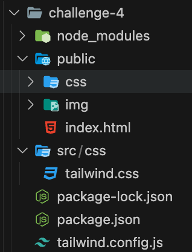
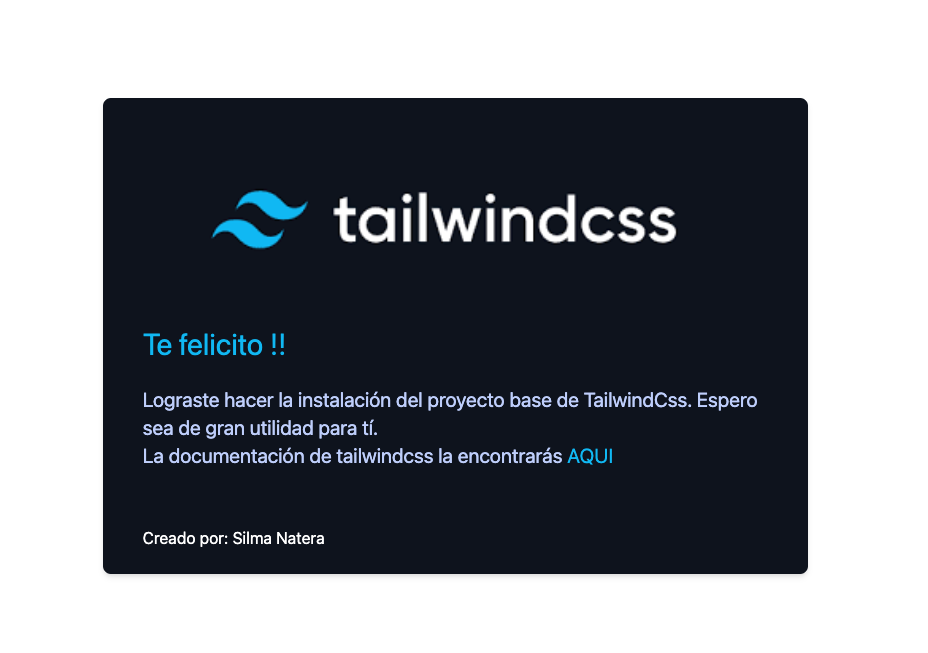

# Proyecto Base para TailwindCss 

En ésta solución se quiere ahorrar el tiempo de instalación y configuración base de un proyecto para tailwindCss. La idea principal es instalar los archivos y librerias básicas para arrancar con un nuevo proyecto sin preocuparte en corregir algún error de instalación del mismo.

## Overview

Con la ejecución de éste script podrás tener una estructura de proyecto básica que te ayudará a arrancar tu app en tailwindCss de manera rápida. Dentro de la estructura que se crea tendrá el archivo de configuración de tailwind y el package.json con las dependencias iniciales. Al finalizar la instalación podrás verificar con un index.html la correcta instalación y configuración.

### Prerrequisitos de Instalación
- node
- npm
- Live Server

### Instalación
- Descargar los archivos. 
- Encontrarás como recursos de instalción:
  -  El archivo **createTailwind.sh**.
  -  Un directorio de **.resources**.
- Ejecutar el archivo .sh de la siguiente manera:
  `./createTailwind.sh`
- Tener en cuenta que para ejecutar el script de instalación ( createTailwind.sh ) debes tener permiso de execución del script.
- Se pedirá nombre el proyecto para hacer la instalación, el nombre del proyecto será obligatorio para poder avanzar.
- Una vez terminada la instalación tendrás dentro del directorio de tu proyecto una estructura como la siguiente:



- Ve a tu **package.json** y en el key "scripts" agrega los siguientes comandos de ejecución:

```javascript
"scripts": {
    "tw:dev": "tailwind -i ./src/css/tailwind.css -o ./public/css/tailwind.css --watch",
    "tw:build": "npx tailwindcss -i ./src/css/tailwind.css -o ./public/css/tailwind.css --minify"
  }
```
- Verás dos comandos de ejecución:
  -  **"tw:dev"**. Comando para ejecución en modo desarrollo.
  -  **"tw:build"**.Comando para ejecución en modo producción.

- Como estamos en modo desarrolo, abre una terminal y ejecuta:
`npm run tw:dev`
- Con el comando del paso anterior se construirán todas las reglas css de tailwind en el archivo **public/css/tailwind.css** y quedará en modo de espera para cargar todos cambios que realices en tu app.
- Finalmente, si estas usando VSC (Visual Studio Code), entonces instala la extensión Live Server y ejecútalo.
- Si la instalación está corecta verás el siguiente resultado:




### Construido con

- Semantic HTML5 markup
- CSS 
- Flexbox
- TailwindCss
- Mobile-first


## Autor

- [@snaterave]

